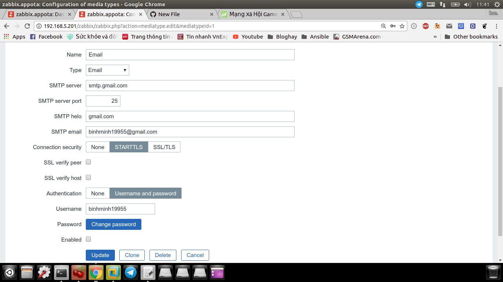

Bước 1: Cấu hình Media Type:

Bước 2: Cấu hình Media trong User:

Bước 3:  Vào configuration => Action => Chọn "Report problems to Zabbix administrators" cái mặc đinh cho đỡ công tạo :) 
 * Action: Tùy chỉnh các nội dung gửi
 
 
 * Condition: Chọn các Trigger để cảnh báo: 
 
 
 * Operation: Cấu hình tùy chọn: Send to User groups hoặc Send to Users
 
 Bước 4: Tạo problem cho trigger: Chỉnh trigger trong host để tạo issue
 
 
 
 
