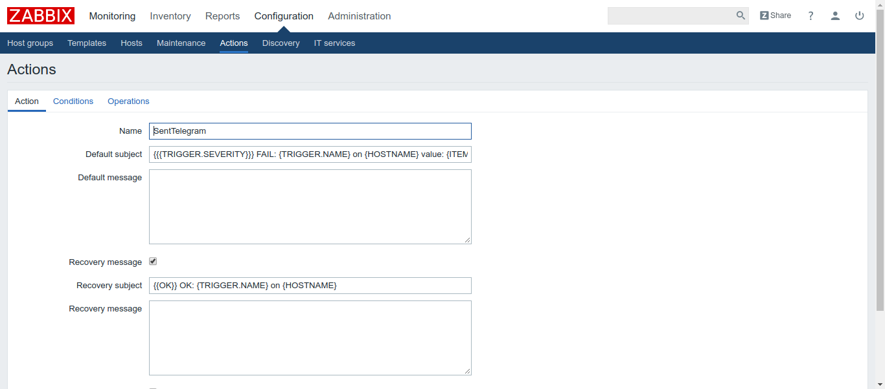

Link: https://www.youtube.com/watch?v=vVIoC2pFscA

Bước 1: Cài đặt và tải script :
sudo apt-get update
sudo apt-get install python-pip -y
sudo pip install --upgrade pip
sudo pip install requests

scripts :
zbxtg.py
https://drive.google.com/open?id=0B6H...

zbxtg_settings.py
https://drive.google.com/open?id=0B6H...

Bước 2: Copy vào thư mục alertscript (thư mục được định nghĩa trong file config zabibx-server)
sudo cp zbxtg.py /usr/lib/zabbix/alertscripts/
sudo cp zbxtg_settings.py /usr/libzabbix/alertscripts/
sudo chmod 755 /usr/local/share/zabbix/alertscripts/zbxtg.py
sudo chmod 755 /usr/local/share/zabbix/alertscripts/zbxtg_settings.py

Bước 3: Tạo bot trong botFather

Telegram botfather
/start
/newbot
=> Lấy được Token: 485183556:AAED64Qp5qx9bYrF9gHQCgIMMHI94yZ6mpc
vào web https://api.telegram.org/bot485183556:AAED64Qp5qx9bYrF9gHQCgIMMHI94yZ6mpc/getUpdates
để lấy username: LeMinh95.

Bước 4: 
- sudo vim /usr/lib/zabbix/alertscripts/zbxtg.py và gõ: set fileformat:unix và lưu lại
- sudo vim /usr/lib/zabbix/alertscripts/zbxtg-setting.py
Chỉnh sửa các tham số theo hình: 

- Nhắn tin bất kỳ đến bot
- /usr/lib/zabbix/alertscripts/zbxtg.py "LeMinh95" "hello" "how are you ?"

Bước 5: Tạo Media Type

Bước 6: Tạo user trên web zabbix

Bước 7: Thêm media type trong user Admin

Bước 8: Tạo Action 

